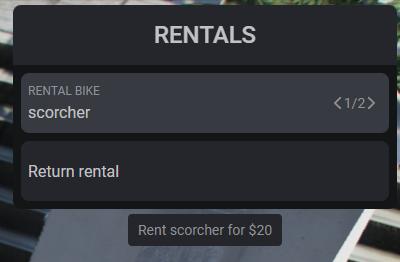
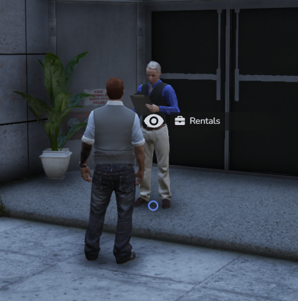
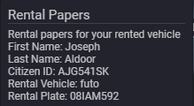

# qbx_rentals
This is a vehicle and bike rental script. It is made for the qbx framework and uses ox_lib and ox_target. I took insipration from two scrits that were built for qbcore framework and converted and mashed them together under one resource utlizing ox_lib and ox_target. Links to the two resources are under credits

# Features
- Fully Configurable
- Checks to see if player has correct amount of cash and handles all the payments server side
- Checks to see if rental spot it open
- Provides rental papers for the vehicle
- Removes rental papers upon return of vehicle
- Not in use 0.00 In use 0.00-0.01
- Ability to return all vehicles 

# Dependencies 
- [ox_target](https://github.com/BerkieBb/qb-target)
- [ox_lib](https://github.com/overextended/ox_lib)
- [qb-menu](https://github.com/qbcore-framework/qb-menu)

# Installation
Drag and drop this right into your resources folder. all changes and adding of vehicles or bikes can be done in the config>server.lua file

Add the following to your ox_inventory items under ox_inventory>data>items.lua

```lua
	['rentalpapers'] = {
		label = 'Rental Papers',
		weight = 100,
		stack = false,
		close = true,
		description = 'Rental papers for your rented vehicle',
	},
```
For the item image drop the png file under images named rentalpapers.png under ox_inventory>web>images

# Optional
*To display the actual metadata of the rental papers (firstname, lastname, rentalmodel, and rentalplate)*
Add the following to any client side script. If you already have this somewhere in another script just append it to that and change the order of the metadata labels.

```lua
local ox = exports.ox_inventory

CreateThread(function()

	ox:displayMetadata({
        [1]     = { firstname     = 'First Name'},
        [2]     = { lastname      = 'Last Name'},
        [3]     = { citizenid     = 'Citizen ID'},
        [4]     = { rentalmodel   = 'Rental Vehicle'},
        [5]     = { rentalplate   = 'Rental Plate'},
	})
end)
```
# Screenshots







# Change Logs
- 0.0.1 - Inital release

# Future Developments
- Make rental papers a usable item that will display the information to anyone nearby and give the keys to vehicle the rentalpapers are registered to
- Reinstate the license check from the original [qb-rentals](https://github.com/carbontheape/qb-rentals)
- Add additional vehicle classes such as boats and planes
- Provide a reimbursement if vehicle is returned to the rental location

# Credits 
- Original qb-rentals author and credit: [itsHyper](https://github.com/itsHyper) & elfishii
- [qb-rentals](https://github.com/carbontheape/qb-rentals) by [Carbontheape](https://github.com/carbontheape)
- [g-bikerentals](https://github.com/Giana/g-bikerentals) by [Giana](https://github.com/Giana)
 